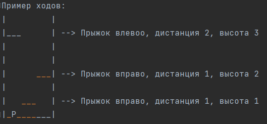

# Башня мемов
Жанр: Текстовый платформер

Игра представляет собой башню, где персонажу нужно перерыгивать на полки, чтобы добраться до следующего этажа.

На каждом этаже лежит мем в качестве приза. (Категорию мемов можно выбрать в meme.py/get_meme())

Так как это текстовая игра, каждый новый ход нужно представлять в воображении, в этом основной "челендж"

- Ширина башни - 3м
- Максимальная высота полки 3м
- Полки бывают - левая, средняя, правая
- Начальная точка - левый нижний угол

Игроку нужно расчитать прыжок и указать на сколько он прыгнет до следующей полки относительно той, где он находится.
При каждом прыжке, предыдущий уровень заполняется кислотой, поэтому нет возможности упасть на предыдущую полку или 
прыгнуть в стену. Если промазал - погибаешь.



## Установка необходимых библиотек

Для удобства все библиотеки собраны в requirements.txt.
Чтобы автоматически установить их введите в терминале:

```
pip install -r requirements.txt
```

[//]: # (Пример ходов: )

[//]: # (|         |)

[//]: # (|___      | --> Прыжок влевоо, дистанция 2, высота 3)

[//]: # (|         |)

[//]: # (|         |)

[//]: # (|      ___| --> Прыжок вправо, дистанция 1, высота 2)

[//]: # (|         |)

[//]: # (|   ___   | --> Прыжок вправо, дистанция 1, высота 1)

[//]: # (|_P_______|)


[//]: # (## Алгоритм:)

[//]: # (1. Рандомизируем горизонтальное положение полки &#40;Лево, Центр, Право&#41;)

[//]: # (   1.1. Пример: Следующая полка находится по центру башни/ по правой части башни)

[//]: # (2. Рандомизируем вертикальное положение &#40;Довольно низко, Довольно высоко, Очень высоко&#41;)

[//]: # (   2.1. Пример: Следующая полка ... и довольно низко/довольно высоко/Очень высоко )

[//]: # (3. В проверке высоты прыжка все просто - 0=низко, 1=высоко, 2=очень высоко, поэтому )

[//]: # (      рандомайзером присваиваем значение и потом проверяем, угадал ли пользователь)

[//]: # (   1. В проверке дистанции сложнее, нужно запоминать текущее положение игрока)

[//]: # (      4.1. КАК ЗАПОМНИТЬ ПОЛОЖЕНИЕ?)

[//]: # (      4.2. Лево=1, Центр=2, Право=3)

[//]: # (      4.3. От текущего положения отнимаем, если прыжок влево и прибавляем, если прыжок вправо, если прыжок на месте,)

[//]: # (            то положение не важно)

[//]: # (      4.4. Рандомим положение полки, отнимаем/прибавляем значение пользователя, если новое полоежние пользователя)

[//]: # (            равно положению полку, то проходит проверку)

[//]: # (      4.5. Если пользователь прыгнул в стену, то значение выходит за диапазон 1-3, значит нужно вывести сообщение )

[//]: # (          "Вы прыгнули в стену и кислота догнала вас")

[//]: # (4. Если игрок не угадал хоть одно число, то он падает в кислоту &#40;показываем acid_fall.jpg&#41;)

[//]: # (5. Если игрок угадал оба числа, увеличиваем его score на 100 и выдаем следующую полку)

[//]: # (6. Если игрок прыгнул на 3 полки, то попадает на этаж, где дополнительно получает Score + 200 и мем из get_meme&#40;&#41;)

[//]: # (7. Общий счет отображается в углу)

## Roadmap:

[//]: # (1. Make base form output on page)

[//]: # (2. Basic game logic)

[//]: # (3. Output meme)

[//]: # (4. connect Bootstrap  https://youtu.be/0mCZdemSsbs)

[//]: # (5. FIX range selector to show value https://stackoverflow.com/questions/10004723/html5-input-type-range-show-range-value)

[//]: # (or: https://stackoverflow.com/questions/67550375/how-to-display-a-bootstrap-range-from-the-one-and-how-to-show-the-value-in-the-i)

[//]: # (6. Push to Github)

[//]: # (7. Initial clean code)

[//]: # (8. fix game_over message transition)

9. Create requirments.txt
10. Convert repetable elements from VIEWs to class or function

[//]: # (10. Remove temp prints)

## Links
Meme API video: https://youtube.com/watch?v=5aYpkLfkgRE